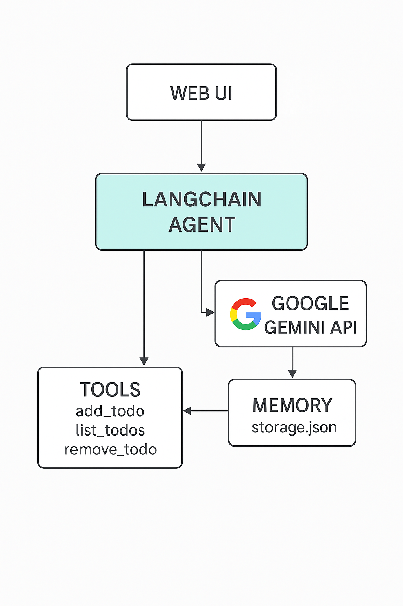
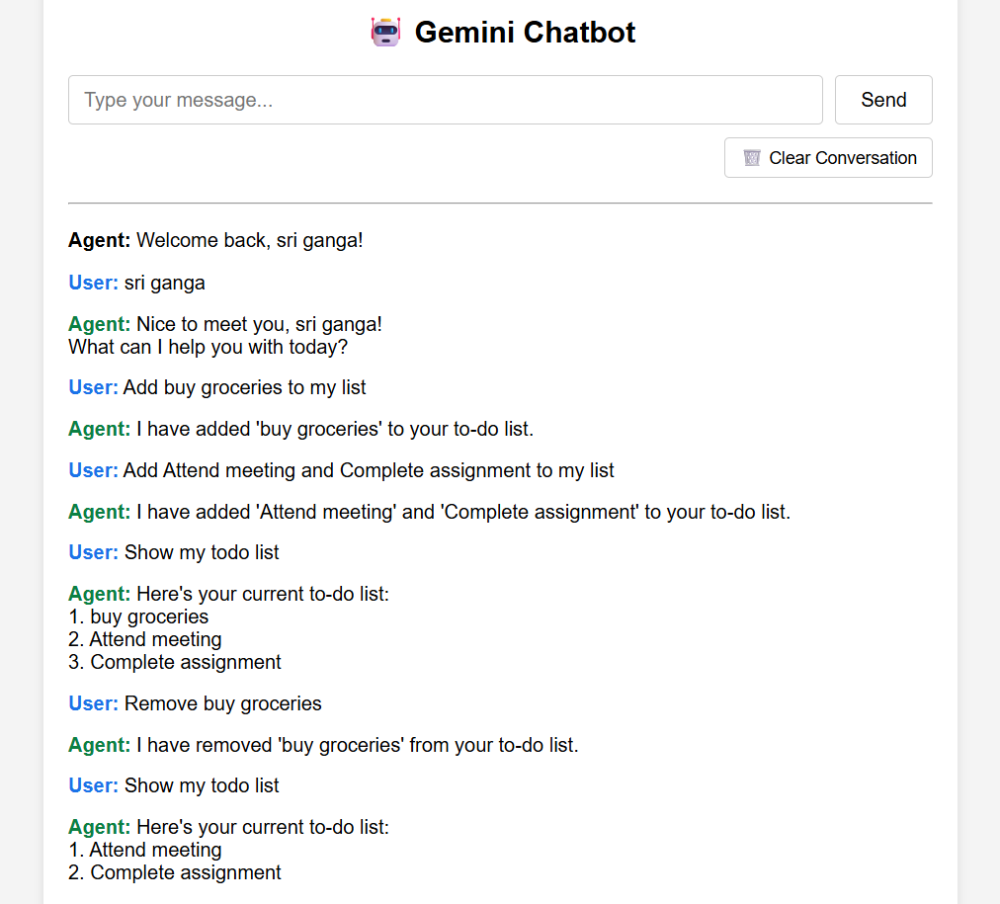

# Gemini Chatbot
**Gemini Chatbot** is a simple and customizable web-based chatbot built using **Python Flask** and **HTML/CSS**. It provides a clean user interface for chatting with a agent, storing message history, and resetting the conversation.

---

## 📁 Project Structure

```
Chatbot/
├── app.py                 # Flask web app (runs the chatbot UI)
├── agent.py               # LangChain agent setup (handles LLM + tools)
├── tools.py               # To-do list tools (add, list, remove)
├── memory.py              # Manages memory (loads/saves storage.json)
├── storage.json           # Persistent storage for name, chat history, todo list
├── requirements.txt       # Python dependencies
├── README.md               # Project documentation

├── templates/
│   └── index.html         # Chatbot web UI (HTML template)

├── architecture.png       # Architecture diagram (for README)
├── screenshot.png         # Chatbot UI screenshot (for README)

```

---

## 🗺️ Architecture Overview



---

- The architecture follows an agentic design using Flask, LangChain, and the Gemini API.
- The Flask frontend handles user interaction through a simple web UI.
- User inputs are processed by a LangChain agent, which decides whether to respond directly or call a tool like add_todo, list_todos, or remove_todo.
- All interactions are stored in a JSON-based memory (storage.json), which saves the user’s name, chat history, and to-do list.
- Users can also reset the conversation and clear the memory to start a new chat from scratch.
  
---

## ✨ Features

The chatbot can:

- **Remember user's name** and previous messages
- **Store and manage a personal to-do list**
- Use **tool calls**:
    - `add_todo`
    - `list_todos`
    - `remove_todo`
- Run on a **Flask web UI**

---

## 🧠Memory Storage

Memory is stored and retrieved using a JSON file called **`storage.json`** until we clear the conversation.

### **Memory includes:**

- `name` → User's name (stored after first message)
- `chat_history` → Full conversation history
- `todo_list` → Contains the to-do list

Memory is **loaded on startup** and **updated after every tool or chat interaction**.

---

## 🔧Tool Calls
Tools are defined in `tools.py` using LangChain's **@tool** decorator:

| Tool                     | Purpose                        |
| ------------------------ | ------------------------------ |
| `add_todo(item: str)`    | Adds an item to the to-do list |
| `list_todos(dummy: str)` | Lists all current to-dos       |
| `remove_todo(item: str)` | Removes a to-do item by name   |

---

### Registration with Agent:

In `agent.py`, the tools are registered with LangChain’s Agent system:
```python
agent_executor = initialize_agent(
    [add_todo, list_todos, remove_todo],
    llm,
    agent=AgentType.CHAT_CONVERSATIONAL_REACT_DESCRIPTION,
    memory=chat_memory,
    verbose=True
)
```
---

# ⚙️ Setup Instructions

### 1️⃣ Clone the Repository

```bash
git clone https://github.com/your-username/Chatbot.git
cd Chatbot
```

### 2️⃣ Set Up Virtual Environment


```bash
python -m venv virtual
.\virtual\Scripts\activate    # For Windows
 #or
source virtual/bin/activate   # For Mac/Linux
```

### 3️⃣ Install Requirements

```bash
pip install -r requirements.txt
```

### 4️⃣ Add Your .env File

Create a .env file in the project root:

```bash
GOOGLE_API_KEY=your-real-api-key-here
```

### 5️⃣ Run the App

```bash
python app.py
```

### 🌐 Access the Web Interface

Open your browser and go to:

http://127.0.0.1:5000

---

💬 Example Prompts
| Prompt                  | What happens?           |
| ----------------------- | ----------------------- |
| Bot asks your name      |  "My name is Ganga"     |
| Adds to-do            |   "Add buy chocolates"  |
| Lists current to-dos  | "Show my to-do list"    |
| Removes that to-do    | "Remove buy chocolates"   |

---

## ⚠️ Limitations:

- Only works with Gemini API key access
- Currently works only with a single user (no login system)
- Simple text interface (Flask form)
  
## 🚀 Future Improvements:

- Add checkbox UI for to-do list
- Add user authentication for multi-user support
- Deploy live on Render / Replit
- Switch to LangGraph for more flexible workflows

---

## 💻 Chatbot UI Screenshot



